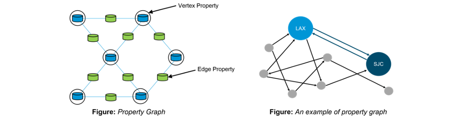
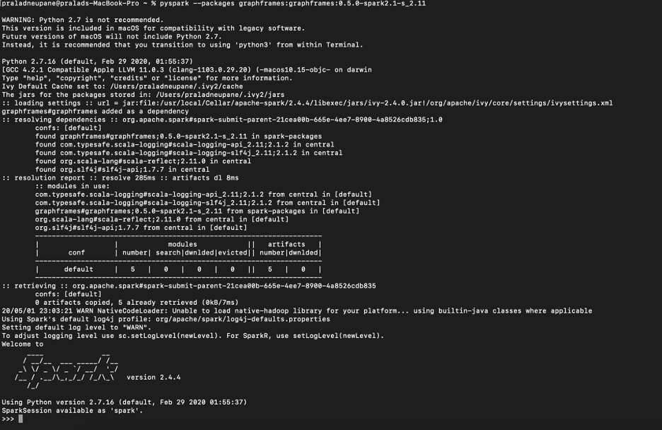
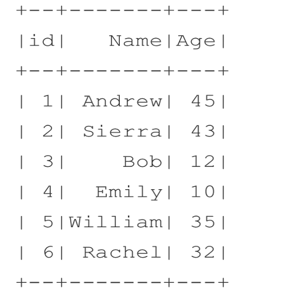
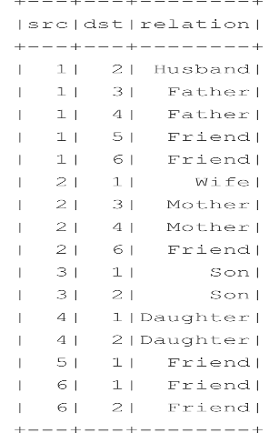
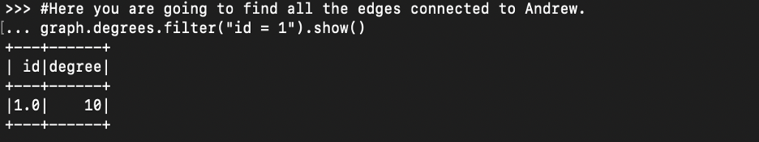
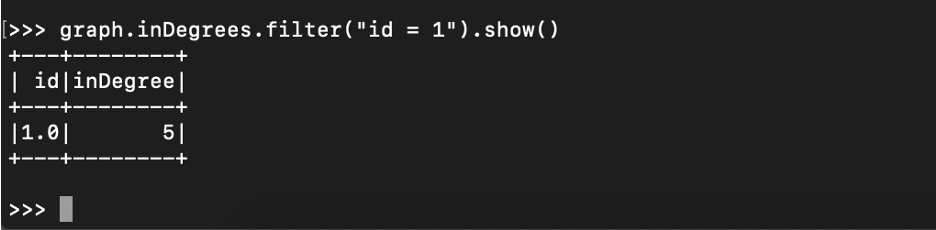
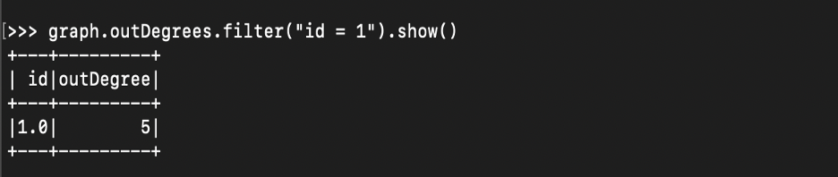
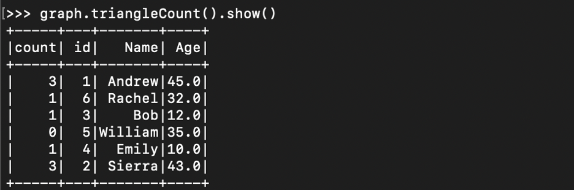
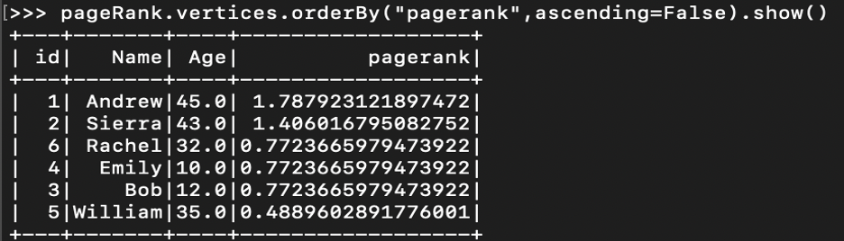
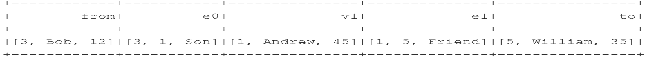

# Spark-GraphX-Relationship_Analysis

In this project we are exploring the family member relationship using GraphX. There are six family members with father, mother, son, daughter and two friends. We are trying to answer which family member have to most connection and which family member have least connection. Also, we can see what the level of relationship between records in dataset. These are the questions solve by GraphX and has been largely used by companies like Facebook and LinkedIn.  
To solve these questions there are many built in algorithm as well as other standard method exist. We are going to discuss some of it here. Here is the few of them. 
1.	Breadth-first search (BFS)
2.	Connected components
3.	Strongly connected components
4.	Label Propagation Algorithm (LPA)
5.	PageRank (regular and personalized)
6.	Shortest paths


GraphX Introduction

GraphX is Apache Spark’s API for graphs and graph-parallel computation. GraphX unifies ETL (Extract, Transform & Load) process, exploratory analysis and iterative graph computation within a single system. The usage of graphs can be seen in Facebook’s friends, LinkedIn’s connections, internet’s routers, relationships between galaxies and stars in astrophysics and Google’s Maps.


 

In Spark, you can get lot of details about the graphs such as list and number of edges, nodes, neighbors per nodes, in degree and out degree score per each node.  The basic graph functions that can be used in PySpark are the following: 
•	vertices
•	edges
•	inDegrees
•	outDegrees
•	degrees

This we how we start the GraphX PySpark



 
Data Set
We have two tables named person and relationship. A person has id, name and age. A relationship table contains source, destination, relationship. Here source and destination are user ids to relationship column show the relationship between them.  
 


    


Sample Code
```
1.	from graphframes import *  
2.	  
3.	  
4.	personsDf = spark.read.csv('in/persion.csv',header=True, inferSchema=True)  
5.	personsDf.createOrReplaceTempView("persons")  
6.	spark.sql("select * from persons").show()  
7.	  
8.	relationshipDf = spark.read.csv('in/relationship.csv',header=True, inferSchema=True)  
9.	relationshipDf.createOrReplaceTempView("relationship")  
10.	spark.sql("select * from relationship").show()  
11.	  
12.	graph = GraphFrame(personsDf, relationshipDf)  
13.	  
14.	#Here you are going to find all the edges connected to Andrew.  
15.	graph.degrees.filter("id = 1").show()  
16.	  
17.	  
18.	personsTriangleCountDf.createOrReplaceTempView("personsTriangleCount")  
19.	maxCountDf = spark.sql("select max(count) as max_count from personsTriangleCount")  
20.	maxCountDf.createOrReplaceTempView("personsMaxTriangleCount")  
21.	spark.sql("select * from personsTriangleCount P JOIN (select * from personsMaxTriangleCount) M ON (M.max_count = P.count) ").show()  
22.	  
23.	  
24.	graph.bfs(fromExpr="Name='Bob'",toExpr="Name='William'").show()  
25.	  
26.	  
27.	graph.bfs(  
28.	   fromExpr = "name = 'Bob'",  
29.	   toExpr = "name = 'William'",  
30.	   ).show()  
```

Find All the edges connected to Andrew



All incoming connection to Andrew 



Number of links coming out from Andrew using the outDegrees
 
 
Triangle Count Problem: This count column identifies how many triangle relationships the vertex is participating in.  
 
 
 
The output shows that Andrew and Sierra have the maximum triangle counts, since they are involved in three kinds of relationships
Apply a PageRank Algorithm
 It was originally started by Google’s founders to identify the most important pages on the Internet. The PageRank algorithm measures the importance of each vertex in a graph. Assume a scenario where one Twitter user has 10 important followers, and each of those followers has multiple followers in turn. This is to say that the PageRank algorithm considers each important follower a legitimate endorsement of the Twitter user and thereby gives a higher ranking to the user.
```
>>> pageRank = graph.pageRank(resetProbability=0.20, maxIter=10)
```

Here, we are calling the PageRank algorithm using the pageRank methods. It takes two attributes
1.	resetProbablity: This value is a random value reset probability (alpha).
2.	maxIter : This is the number of times you want pageRank to run.

You can see from the original persons schema that a new column has been added called pagerank and new column weight has been added to the original relationship schema. These both columns contributed to the PageRank score


 
What is the PageRank Score?
 
 

Let's look at the weight: weight is the determining factor to calculate page rank


 
As you can see from the table William’s relationship with Andrew gets the maximum weight since it is unique. No one other than Andrew is a friend to William. 
Apply the Breadth First Algorithm
Let's find the shortest way to connect to the people. We are going to apply BFS. You might have often noticed LinkedIn telling you how far you are from any new user. For example, you will notice that a user whom you would like to connect to is a second connection or a third connection. This tells you that you are two vertices away from the vertex from where you are looking. This is one way of identifying how far a vertex is to another vertex. Another example is finding the shortest path between two city or two airports. Breadth First search is one of the shortest path-finding algorithms and it helps us identify the shortest path between two vertices.
Find the connection between Bob and William
Since only Andrew is directly connected to William. So, for Bob to be able to connect to William, what is the shortest path?
HOW IT WORKS
	GraphFrames provides an API, called bfs, which takes a minimum of two parameters. Those are:
	fromExpr: Expression to identify the from vertex.
	toExpr: Expression to identify the to vertex.
graph.bfs(fromExpr=""Name='Bob'"",toExpr=""Name='William'"").show(). We are looking for shortest path between William and ‘Bob.


 


